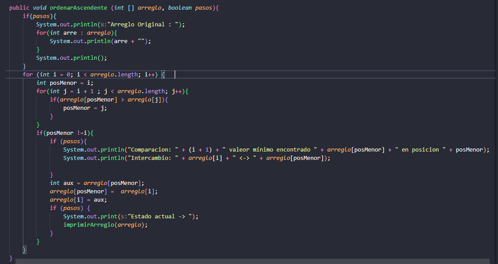
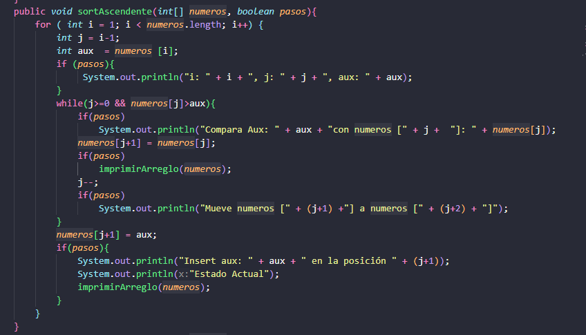
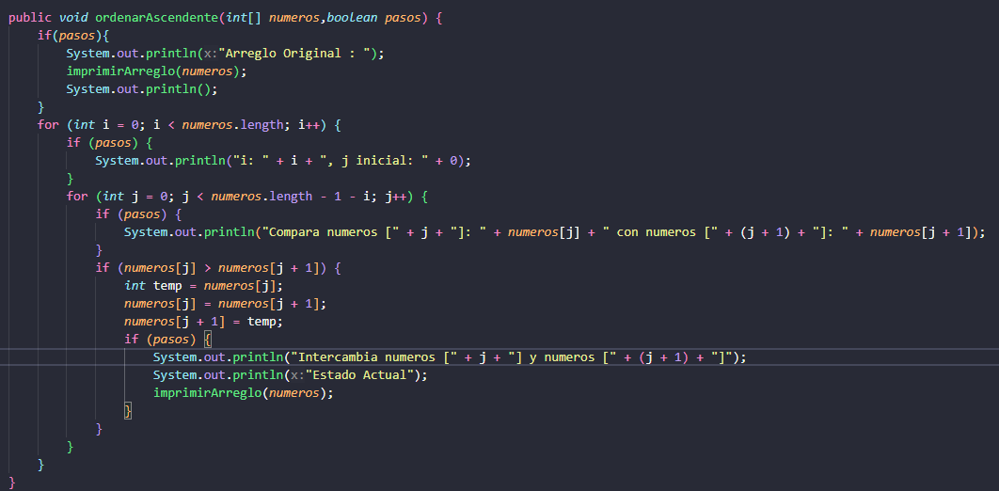

## Algoritmos de Ordenamiento - Práctica
## Estructura de Datos
### Nombre: **Diana Borja**
### Fecha: **28/OCT**

### Explicación de los métodos Implementados

# 1.- Sort Selection
Selection Sort divide el array en una sub-lista ordenada y una desordenada. En cada pasada, encuentra el elemento minímo del sub-array desordenado y lo coloca en su posición final mediante un solo intercambio por iteracion principal

### **Explicacion de la Busqueda**
El bucle interno (j) busca el índice del valor más pequeño en la posicion no ordenada. Al finalizar la busqueda, si el minimo no esta ya en la posicion actual, se realiza un intercambio para asi fijar el elemento en su lugar.

### **Captura del Método**

# 2.- Sort Insertion

Este método implementa el algoritmo de Ordenamiento por Inserción de forma ascendente. Este algoritmo funciona dividiendo el arreglo en una sub-lista ordenada a la izquierda y una sub-lista desordenada a la derecha. En cada iteración, toma un elemento de la sub-lista desordenada y lo inserta en su posición correcta dentro de la sub-lista ordenada.
### **Captura del Método**

# 3.- Sort Bubble
Este método implementa el algoritmo de Ordenamiento de Burbuja (Bubble Sort) en su versión simple (sin optimización de parada temprana) para ordenar un arreglo de forma ascendente. El algoritmo compara repetidamente elementos adyacentes y los intercambia si están en el orden incorrecto, haciendo que los valores mayores "suban" o "burbujeen" hacia el final del arreglo en cada pasada.
### **Captura del Método**

# 4.- Sort Bubble Mejorado

El objetivo del Bubble Sort Mejorado es realizar la misma tarea de ordenamiento que la versión simple ($O(n^2)$ en el peor caso), pero con la capacidad de terminar mucho más rápido, en $O(n)$, si el arreglo está ya ordenado o casi ordenado.
### **Captura del Método**

## Conclusion
Mi conclusión al implementar los métodos de Selección, Inserción y Burbuja (Simple y Mejorada) es que la estrategia de movimiento del algoritmo es más importante que solo lograr el ordenamiento. Descubrí que la Burbuja Simple es la menos eficiente por revisar siempre el arreglo ($O(n^2)$), mientras que los métodos con detección de orden —como la Burbuja Mejorada  e Inserción (por su eficiencia con arreglos casi ordenados)— demuestran una superioridad práctica al lograr una complejidad de $O(n)$ en el mejor de los casos. Es por ello que el método de Selección es el más consistente en su ineficiencia, ya que siempre realiza la misma cantidad de comparaciones, independientemente del estado inicial del arreglo.